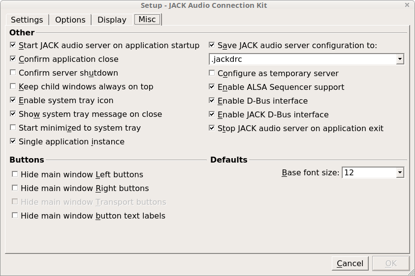
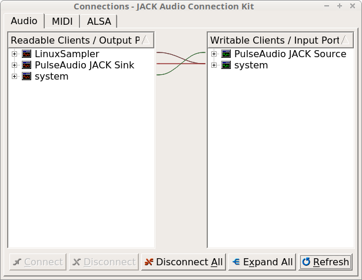
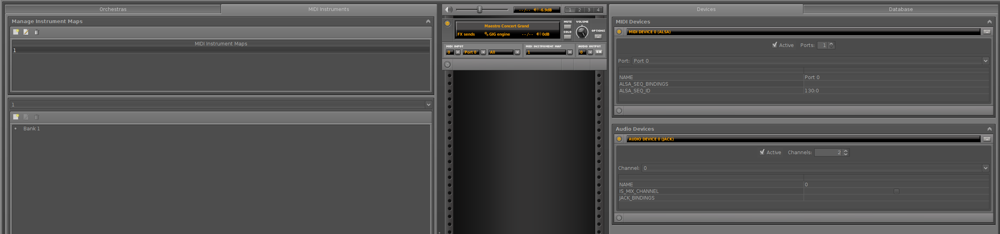
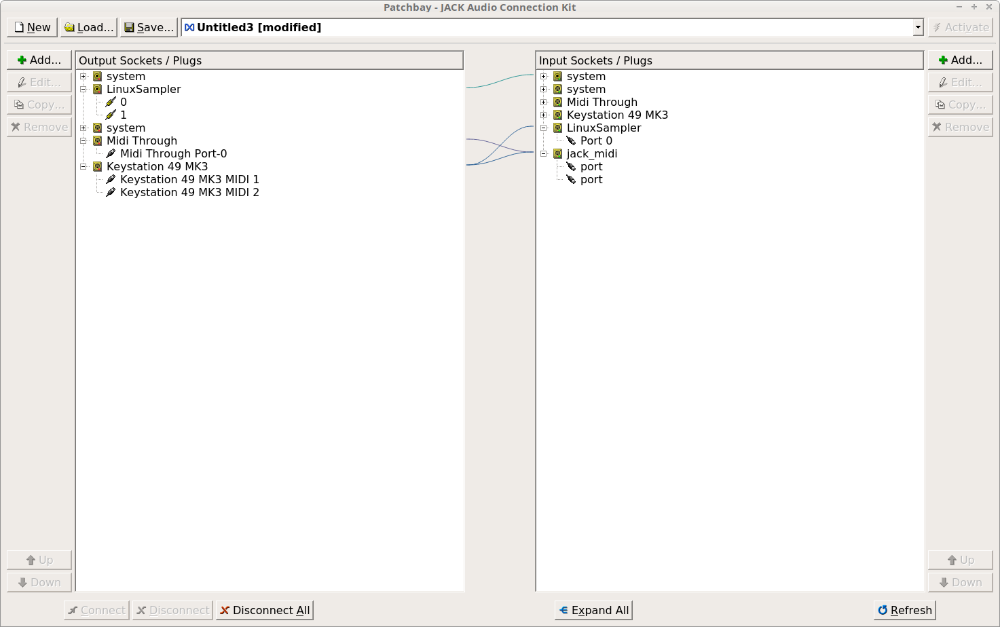

# Sound
On HP Omen laptop in Linux Mint 18

### Remove sound clicking
add to `/etc/modprobe.d/alsa-base.conf`
```
options snd-hda-intel power_save=10
```

### [JACK + pulseaudio](https://askubuntu.com/questions/572120/how-to-use-jack-and-pulseaudio-alsa-at-the-same-time-on-the-same-audio-device)  
install JACK and module to route pulseaudio to JACK  
```
apt install jack jackd2 libjack-jackd2-dev pulseaudio-utils pulseaudio-module-jack
```

enable D-bus in qjackctl


add to /etc/pulse/default.pa  
```
load-module module-jack-sink
load-module module-jack-source
```

restart pulseaudio
```
pulseaudio -k
pulseaudio -D
```

When playing audio, for example Firefox, one should see


### Midi keyboard + [LinuxSampler](https://linuxsampler.org) + pulseaudio
Compile LinuxSampler with JACK  
you need `libjack-jackd2-dev` for that  

Start JACK audio output channel in JSampler
  

Connect midi keyboard to LinuxSampler port and LinuxSampler to system like this

