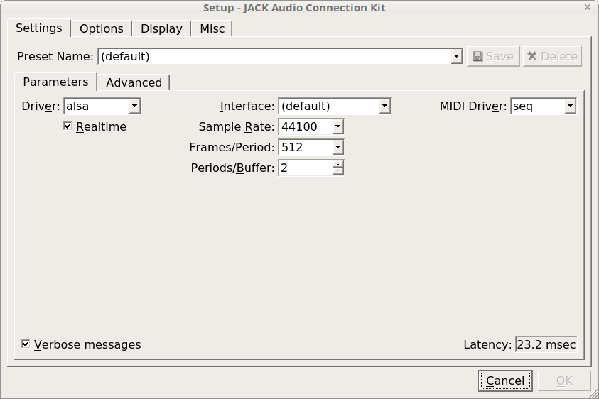

# Sound
Written for HP Omen laptop and Linux Mint 18  

[Remove clicking noise](#remove_sound_clicking)  
[How to use JACK with pulseaudio](#jack_with_pulseaudio)  
[Set up midi keyboard and sampler](#midi_keyboard_with_sampler)  

## Remove sound clicking
I had it from the very start or may be after power management adjustments.  

Add to `/etc/modprobe.d/alsa-base.conf`  
```
options snd-hda-intel power_save=10
```

## JACK with pulseaudio
Problem arised when I switched to JACK as main audio server.  
[Recipe source on askubuntu](https://askubuntu.com/questions/572120/how-to-use-jack-and-pulseaudio-alsa-at-the-same-time-on-the-same-audio-device)  

Install JACK and module to route pulseaudio to JACK  
```
apt install jack jackd2 libjack-jackd2-dev pulseaudio-utils pulseaudio-module-jack
```

enable D-bus in qjackctl  


add to /etc/pulse/default.pa  
```
load-module module-jack-sink
load-module module-jack-source
```

restart pulseaudio
```
pulseaudio -k
pulseaudio -D
```

When playing audio, for example Firefox, one should see  


After every reboot JACK must be started before any sound application
TODO

## MIDI keyboard with sampler
Set MIDI driver `seq` in qjackctl parameters  

  

Compile [LinuxSampler](https://linuxsampler.org) with JACK, for that you'll need  
```
apt install libjack-jackd2-dev
```  

Start JACK audio output channel in JSampler (LinuxSampler GUI)  

  

Connect MIDI keyboard to LinuxSampler port and LinuxSampler to system like this  


