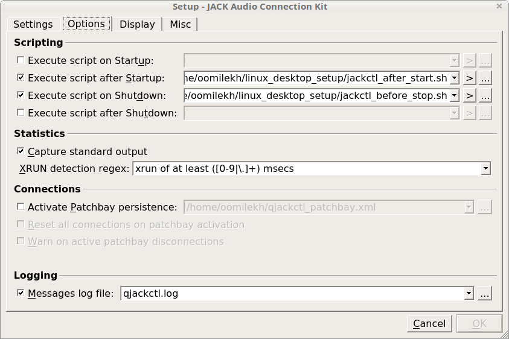
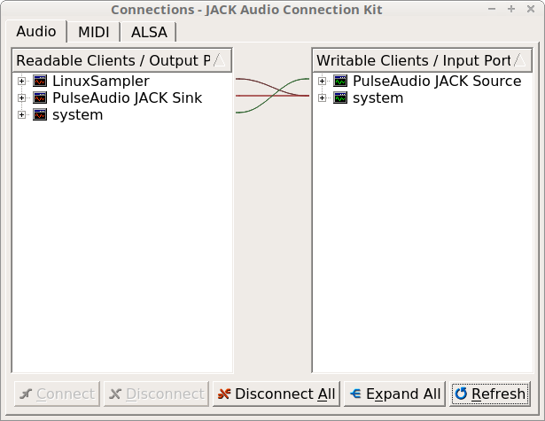
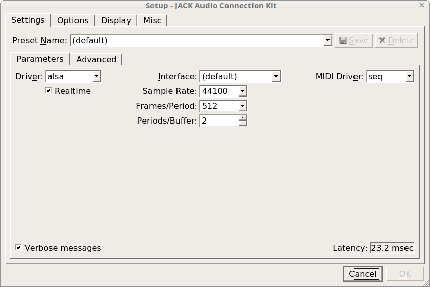
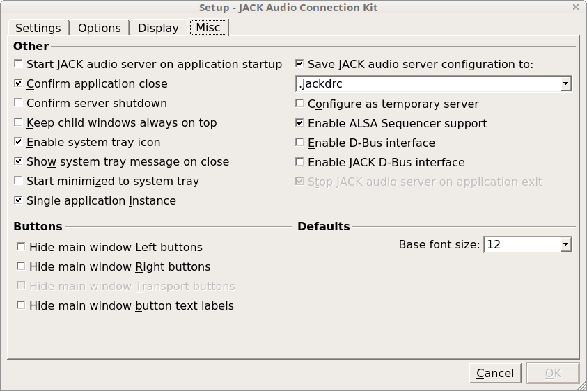
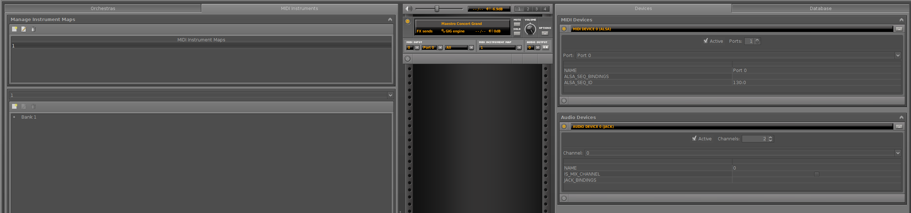
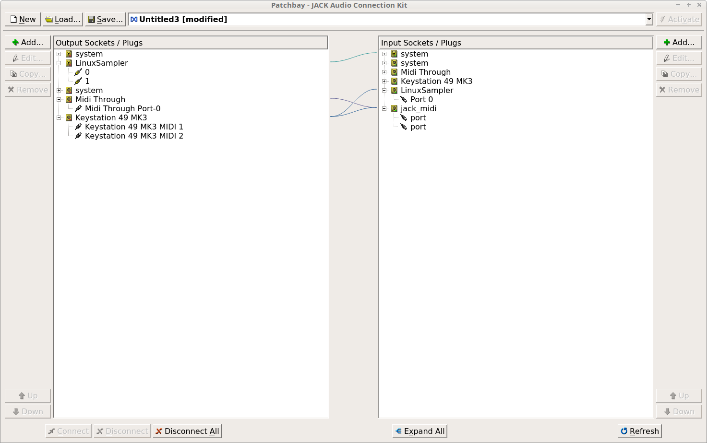

# Sound
Written for HP Omen laptop and Linux Mint 18  

[Remove clicking noise](#remove_sound_clicking)  
[How to use JACK with pulseaudio](#jack_with_pulseaudio)  
[Set up midi keyboard and sampler](#midi_keyboard_with_sampler)  

## Remove sound clicking
I had it from the very start or may be after power management adjustments.  

Add to `/etc/modprobe.d/alsa-base.conf`  
```
options snd-hda-intel power_save=10
```

For some reason I have this script that should be executed with sudo  
```
hda-verb /dev/snd/hwC0D0 0x20 SET_COEF_INDEX 0x67
hda-verb /dev/snd/hwC0D0 0x20 SET_PROC_COEF 0x3000
```
But these days it's all fine without it

## JACK with PulseAudio
Problem arised when I switched to JACK as main audio server. JACK and PulseAudio both use ALSA on low-level and they block each other.  
[Recipe source on askubuntu](https://askubuntu.com/questions/572120/how-to-use-jack-and-pulseaudio-alsa-at-the-same-time-on-the-same-audio-device)  

Install JACK and module to route PulseAudio to JACK  
```
apt install jack jackd2 libjack-jackd2-dev pulseaudio-utils pulseaudio-module-jack
```

Configure qjackctl `setup->options`  
[script](./jackctl_after_start.sh) after startup
```
pactl load-module module-jack-sink
pactl load-module module-jack-source
pacmd set-default-sink jack_out
```
[script](./jackctl_before_stop.sh) before shutdown
```
pactl unload-module module-jack-sink
pactl unload-module module-jack-source
```
  

This way when you start jack server in qjackctl, pulseaudio will use it (but in player you have to pause/play).  
And when you stop jack, pulseaudio will fall back to direct use of sound card instantly.  

When playing audio, for example in Firefox, one should see  



And last, to control volume use `alsamixer`

## MIDI keyboard with sampler
Set MIDI driver `seq` in qjackctl parameters  

  

Enable ALSA sequencer  



Compile [LinuxSampler](https://linuxsampler.org) with JACK, for that you'll need  
```
apt install libjack-jackd2-dev
```  

Start JACK audio output channel in JSampler (LinuxSampler GUI)  

  

Connect MIDI keyboard to LinuxSampler port and LinuxSampler to system like this  



You can save configuration in JSampler as script and execute it directly in LinuxSampler.  
Check [here](./linuxsampler)

## Switch to headset mic
This is how to automatically switch the microphone on plug/unplug:

acpi_listen is the tool to detect when you plug/unplug the headset. This is what it detects:
```
jack/headphone HEADPHONE unplug
jack/headphone HEADPHONE plug
```
pulseaudio is where we can switch source ports

In my system to select headset microphone:
```
pacmd set-source-port alsa_input.pci-0000_00_1f.3.analog-stereo analog-input-headset-mic
```
To select internal microphone:
```
pacmd set-source-port alsa_input.pci-0000_00_1f.3.analog-stereo analog-input-internal-mic
```
You can use pacmd list-cards to get a list of sources names and ports names.
You can also use the terminal auto-complete feature to help craft the commands.
Now, let's bring everything together:

Switch to root with sudo su and create the script /etc/acpi/headset-microphone.sh
```
#!/bin/sh
export PULSE_RUNTIME_PATH="/run/user/1000/pulse/"
if [ "$1" = plug ]; then
  sudo -u you -E pacmd set-source-port alsa_input.pci-0000_00_1f.3.analog-stereo analog-input-headset-mic
else
  sudo -u you -E pacmd set-source-port alsa_input.pci-0000_00_1f.3.analog-stereo analog-input-internal-mic
fi
```
be sure to:

    change you to your username
    replace the pulseaudio source and ports with your values
    make the script executable, `chmod a+x /etc/acpi/headset-microphone.sh`

then create the event listener, creating a file ´/etc/acpi/events/headset-microphone-plug´:
```
event=jack/headphone HEADPHONE plug
action=/etc/acpi/headset-microphone.sh plug
```
and the unplug event listener, creating a file ´/etc/acpi/events/headset-microphone-unplug´:
```
event=jack/headphone HEADPHONE unplug
action=/etc/acpi/headset-microphone.sh unplug
```
and, as last thing, restart the acpi listening events service
```
systemctl restart acpid.service
```
